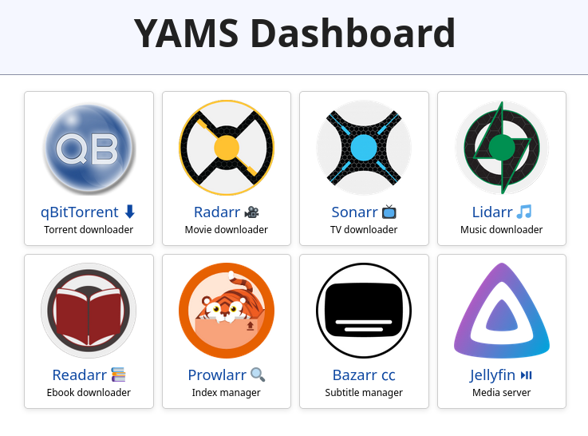

# YamsWeb - A web UI for YAMS

[YAMS](https://yams.media) is a media server set up script that automatically handles services like qBitTorrent, *arr apps, and a media server like Jellyfin. By default it opens up on a laundry list of ports like so:

```
Service URLs:
qBittorrent: http://IP:8080/
Radarr: http://IP:7878/
Sonarr: http://IP:8989/
Lidarr: http://IP:8686/
Readarr: http://IP:8787/
Prowlarr: http://IP:9696/
Bazarr: http://IP:6767/
jellyfin: http://IP:8096/
Portainer: http://IP:9000/
```

Memorizing these URLs or even bookmarking them is boring! So I created a simple lightweight HTML web UI. It simply hosts links to these services. That's all!



### Configuration

Configuration is easy - simply define a volume to hold the configs and expose the ports.

```bash
mkdir yamsweb
# Modify this list to your heart's content. The full list of available apps to add can be found in index.html
# You can change jellyfin to plex or emby and the icons still work
echo "qbittorrent,radarr,sonarr,lidarr,readarr,prowlarr,bazarr,jellyfin" | tee yamsweb/apps.txt
# 3000 is the internal port, 4242 is the external port.
docker run -d -p 4242:3000 --name yamsweb -v $(pwd)/yamsweb:/home/static/apps quay.io/sigaloid/yamsweb
```

Or, add to your docker-compose:
```yaml
  yamsweb:
    image: quay.io/sigaloid/yamsweb
    container_name: yamsweb
    volumes:
      - ${INSTALL_DIRECTORY}/config/yamsweb:/home/static/apps
    ports:
      - 4242:3000
```

Now open [IP]:4242!

### Port prefix mode

If you're like me, you hate viewing your local services with an insecure HTTP connection. Even if you're on your own network, or over a Tailscale network, still annoying to click through the HTTPS everywhere prompt in Firefox. Well, what I do is use Tailscale's Caddy integration in order to HTTPS-ify my server, while keeping it private and away from the internet (limited to my Tailscale network). But you can't do subdomaining with Tailscale, it's a pain to subdirectorify everything, so my fix is to expose each service over a port on the same HTTPS server via Caddy. But you can't listen on :8080 if there's a local program doing so, and manually changing every app to only listen on localhost is annoying. So what I do is modify the port. My caddy config:

```caddy
# override for yamsweb
https://ts-site.ts.net {
       	reverse_proxy :4242
}

# service with 1 prepended to port
https://ts-site.ts.net:18080 {
       	reverse_proxy :8080
}

# etc
https://ts-site.ts.net:17878 {
       	reverse_proxy :7878
}

# ... more for every service of yours
```

This way, you can simply access "device.tailscale-network.ts.net" on any Tailscale-connected device and it will load your web UI!


I appended a 1 to every port and reverse proxied it with SSL. But that breaks the links in this site! So if you want to manually prefix this type of thing to your ports linked here, put the number in `yamsweb/portprefix.txt`. I put 1, so it adds 1 to every port.